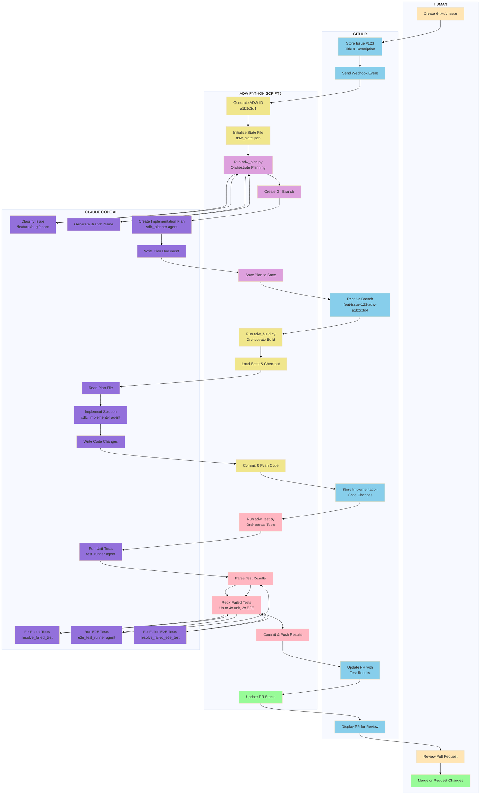
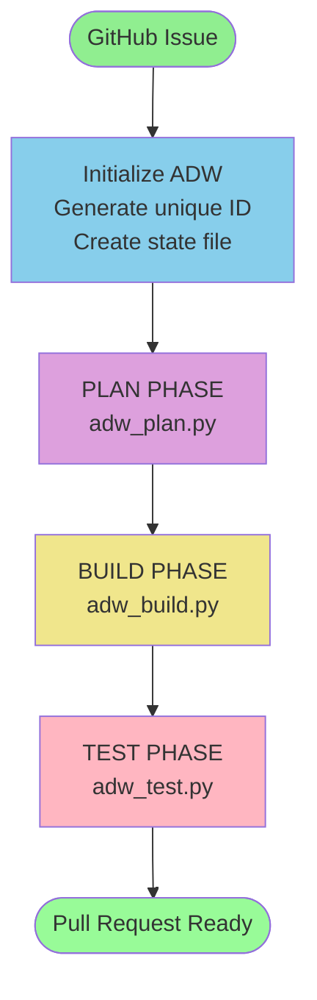
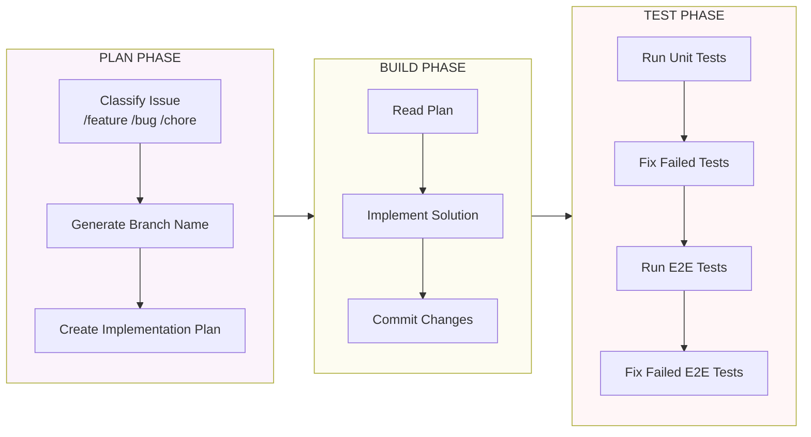
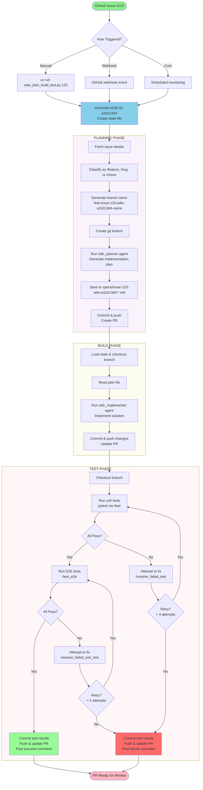

# ADW Simple Workflow Flowchart

## Overview
ADW (Application Development Workflow) is an automated Plan-Build-Test system that processes GitHub issues through three main phases.

## Swim Lane Diagram - Actor Interactions

This diagram shows how Human, GitHub, ADW Python scripts, and Claude Code interact throughout the workflow.



### Actor Responsibilities

**Human**
- Creates GitHub issues describing features, bugs, or chores
- Triggers ADW workflow manually or via webhook/cron
- Reviews and merges the final pull request

**GitHub**
- Stores issues, code repositories, and documentation
- Sends webhook events on issue creation
- Hosts branches, pull requests, and issue comments
- Provides API access to issue data

**ADW Python**
- Orchestrates the three-phase workflow (Plan, Build, Test)
- Manages state persistence across phases
- Handles git operations (branch, commit, push)
- Parses and processes test results
- Implements retry logic for failed tests
- Updates GitHub with progress and results

**Claude Code**
- Classifies issues into feature/bug/chore categories
- Generates appropriate branch names
- Creates detailed implementation plans
- Implements the solution based on the plan
- Runs and analyzes test results
- Automatically fixes failing tests
- Provides AI-powered development assistance

## High-Level Flow



## Three Phase Workflow



## Detailed Workflow



## Key Components

### State Management
```json
{
  "adw_id": "a1b2c3d4",
  "issue_number": "123",
  "issue_class": "/feature",
  "branch_name": "feat-issue-123-adw-a1b2c3d4-name",
  "plan_file": "specs/issue-123-adw-a1b2c3d4-name.md"
}
```

### Trigger Methods
1. **Manual**: `uv run adw_plan_build_test.py ISSUE_NUMBER`
2. **Webhook**: GitHub webhook on issue creation
3. **Cron**: Scheduled monitoring for new/tagged issues

### Test Retry Logic
- **Unit Tests**: Up to 4 attempts with automatic resolution
- **E2E Tests**: Up to 2 attempts with automatic resolution
- **E2E Requirement**: Only runs if unit tests pass

### Output
- Git branch with changes
- Pull request to main branch
- Issue comments tracking progress
- Committed plan and implementation
- Test results

## Quick Summary

1. **Issue Created** → ADW triggered
2. **Plan**: Classify → Branch → Generate plan → Commit
3. **Build**: Load plan → Implement → Commit
4. **Test**: Unit tests → E2E tests → Auto-fix failures → Commit
5. **Result**: PR ready with all changes and test results
