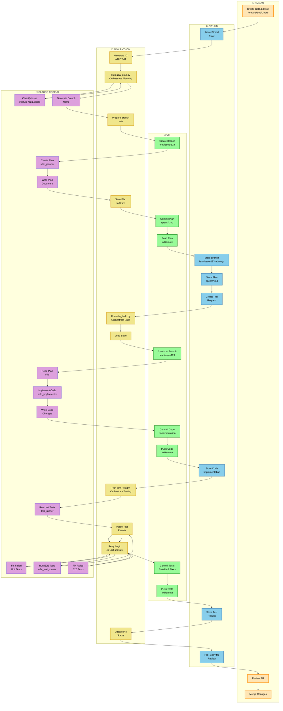

# ADW Simple Workflow - Swim Lane Diagram

## Overview
ADW (Application Development Workflow) is an automated Plan-Build-Test system that processes GitHub issues through three main phases.

## Swim Lane Diagram

This diagram shows the workflow across five swim lanes representing Human, GitHub, Git, ADW Python, and Claude Code.



## Workflow Flow Across Lanes

### Phase 0: Initialization
1. **HUMAN** → Creates issue
2. **GITHUB** → Stores issue
3. **ADW PYTHON** → Generates unique ADW ID

### Phase 1: Planning
1. **ADW PYTHON** → Runs adw_plan.py, fetches issue data from GitHub
2. **CLAUDE CODE** → Classifies issue, generates branch name
3. **ADW PYTHON** → Prepares branch information
4. **GIT** → Creates new feature branch
5. **CLAUDE CODE** → Creates implementation plan (sdlc_planner)
6. **ADW PYTHON** → Saves plan to state
7. **GIT** → Commits and pushes plan to remote
8. **GITHUB** → Stores branch, plan file, creates pull request

### Phase 2: Building
1. **ADW PYTHON** → Runs adw_build.py, loads state
2. **GIT** → Checks out feature branch
3. **CLAUDE CODE** → Reads plan, implements solution (sdlc_implementor)
4. **GIT** → Commits and pushes implementation to remote
5. **GITHUB** → Stores code changes

### Phase 3: Testing
1. **ADW PYTHON** → Runs adw_test.py
2. **CLAUDE CODE** → Runs unit tests (test_runner)
3. **ADW PYTHON** → Parses results, manages retry logic
4. **CLAUDE CODE** → Fixes failed tests (up to 4 attempts)
5. **CLAUDE CODE** → Runs E2E tests (e2e_test_runner)
6. **CLAUDE CODE** → Fixes failed E2E tests (up to 2 attempts)
7. **GIT** → Commits and pushes test results to remote
8. **GITHUB** → Stores test results
9. **ADW PYTHON** → Updates PR status

### Phase 4: Review
1. **GITHUB** → Displays PR ready for review
2. **HUMAN** → Reviews and merges PR

## Actor Responsibilities

| Actor | Role | Key Activities |
|-------|------|----------------|
| **👤 HUMAN** | Initiator & Reviewer | Creates issues, triggers workflow, reviews and merges PRs |
| **🌐 GITHUB** | Storage & Integration | Stores issues/code/PRs, sends webhooks, provides API access |
| **📂 GIT** | Version Control | Creates branches, commits changes, pushes to remote |
| **🐍 ADW PYTHON** | Orchestrator | Manages workflow phases, state persistence, retry logic |
| **🤖 CLAUDE CODE AI** | Developer | Classifies, plans, implements, tests, and fixes code automatically |

## Key Components

### State Management
```json
{
  "adw_id": "a1b2c3d4",
  "issue_number": "123",
  "issue_class": "/feature",
  "branch_name": "feat-issue-123-adw-a1b2c3d4-name",
  "plan_file": "specs/issue-123-adw-a1b2c3d4-name.md"
}
```

### Trigger Methods
1. **Manual**: `uv run adw_plan_build_test.py ISSUE_NUMBER`
2. **Webhook**: GitHub webhook on issue creation
3. **Cron**: Scheduled monitoring for new/tagged issues

### Test Retry Logic
- **Unit Tests**: Up to 4 attempts with automatic resolution
- **E2E Tests**: Up to 2 attempts with automatic resolution
- **E2E Requirement**: Only runs if unit tests pass

## Quick Summary

**HUMAN** creates issue → **GITHUB** stores → **ADW PYTHON** orchestrates → **CLAUDE CODE** plans → **GIT** creates branch & commits → **GITHUB** stores → **ADW PYTHON** manages → **GIT** checks out → **CLAUDE CODE** implements → **GIT** commits & pushes → **GITHUB** stores → **ADW PYTHON** orchestrates testing → **CLAUDE CODE** tests & fixes → **GIT** commits & pushes → **GITHUB** updates → **HUMAN** reviews & merges
